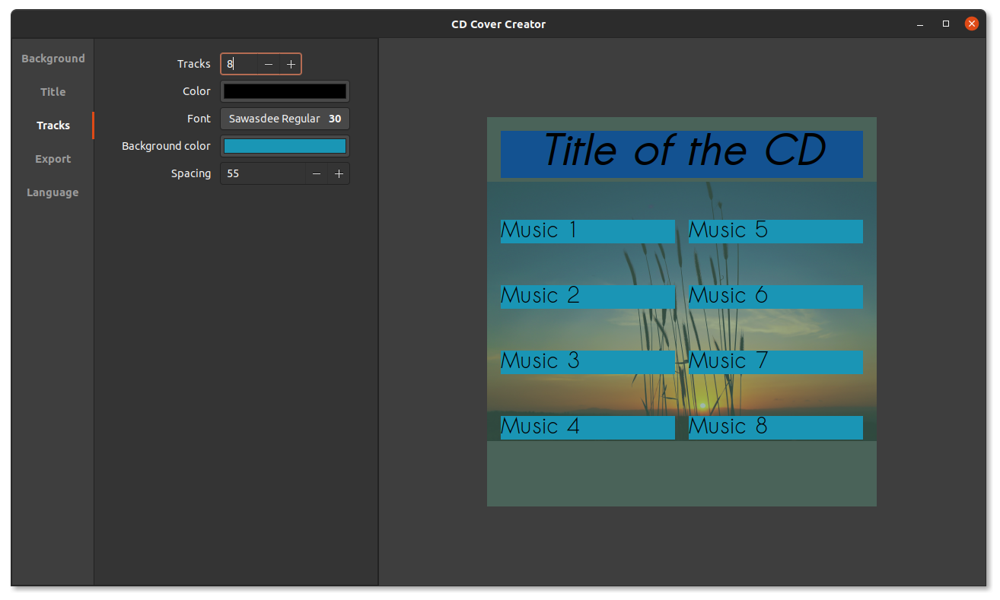

# CD Cover Creator
---

If you happen to still use CDs to listen to music, you could use this piece of software.

It can create covers for CD cases (12x12cm), with a multitude of options to customize it.

You can print the covers and save them in a special format to reuse them later.

---

## Known bugs :

 - When changing the font size of the title or the tracks, the text resizes but not the box around it, causing it to clip the text. To "fix" that, just change the text and the box will resize.

 - When loading a previously saved file, the bottom of the image can be glitched. You can reload the image to fix this problem.

## Building :

There is a Github release with Windows 10 64 binaries, else you can build it for Linux and Windows (with the WindowsMakefile). I haven't tried it on MacOS but it should work since it is made with GTK3.